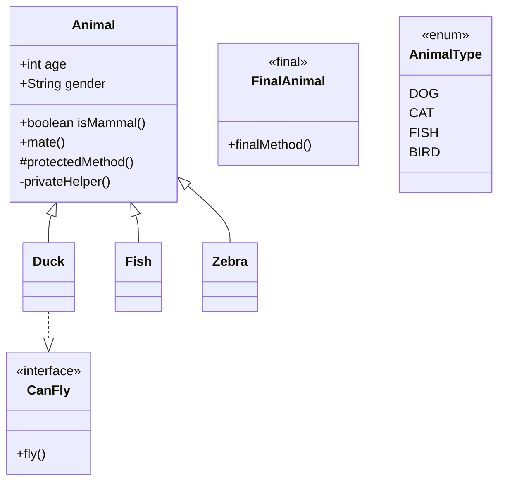

#Note
2025-04-07
Tags: [[Grundlagen Programmierung]] [[Java]] 

### Datentypen

```Java
// Numerische Werte
int num = 2; // primitiv (short, long, byte)
double decNum = 1.2; // primitiv (float)

// Wörter und bool'sche Werte
String word = "Hello"; // komplex
char character = 'm'; // primitiv
boolean check = true; // primitiv
```

### Operatoren
```Java
int a = 3;
int b = 2;
int addition = a + b; // 5
int subtraktion = a - b; // 1
int multiplikation = a * b; // 6
int division = a / b; // 1 (Wegen int)
int restwert = a % b; // 1

a++ // Inkrementiert nach Verwendung 
++a // Inkrementiert vor Verwendung
a-- // Dekrementiert nach Verwendung
--a // Dekrementiert vor Verwendung
```

- **Vergleichsoperatoren** (Ergebnis ist boolean Wert)
```Java
result = a < b;
result = a <= b;
result = a > b;
result = a >= b;
result = a == b;
result = a != b 
```

- **Logische Operatoren**
```Java
boolean t = true;
boolean f = false;
// AND
result = t && f;
// OR
result = t || f;
// NOT
result = !f;
```

### Kontrollstrukturen
- **If**
```Java
if (Bedingung) {
    Code
} else if (Bedingung) {
    Code
} else {
    Code
}
```

- **Switch** (mit Cases)
```Java
switch (Bedingung) {
    case Fall [Ausprägung der Bedingung]: 
        Code;
    case Fall [Ausprägung der Bedingung]:
        Code;
        break;
    default:
        Unbehandelte Fälle;
        break;
}
```

### Schleifen
- **While**
```Java
while (Bedingung) {
    Code;
}
```

- **Do-While**
```Java
do {
    Code;
} while (Bedingung)
```

- **For**
```Java
for (Iterator; Bedingung; Operation) {
    Code;
}
```

- **For-each**
```Java
for (Iterator : Sammlung) {
    Code;
}
```

- **Break & Continue**
```Java
break;     // Bricht komplette Schleife ab
continue;  // Springt zur nächsten Iteration
```

### Methoden
```Java
public class Recap {
    public static void main(String[] args) {
          System.out.println("Hello world");  
    }
} // void = kein Rückgabewert
```

### Array und ArrayList
```Java
// Array
String[] cars = { "BMW", "Audi", "Benz" };
int[] values = new int[2]; // {0, 0}
int length = values.length;

// ArrayList
ArrayList<Integer> values2 = new ArrayList<>();
values2.add(1);
int size = values2.size();
```

### Klassen & Objekte
```Java
public class Human {
    private String firstName;
    public int age;

    public String getName() {
        return firstName;
    }
}
```

- **Konstruktor (Überladung)**
```Java
public Human(String firstName) {
    this.firstName = firstName;
}

public Human(String firstName, int age) {
    this.firstName = firstName;
    this.age = age;
}
```

### Vererbung
```Java
public class Animal {
    public String name;

    public Animal(String name) {
        this.name = name;
    }
    public String getName() {
        return this.name;
    }
}

public class Dog extends Animal {
    public Dog(String name) {
        super(name);
    }
}
```

### Polymorphie
```Java
ArrayList<Animal> animals = new ArrayList<>();
animals.add(new Dog("Bello"));
animals.add(new Cat("Mina"));

for (Animal animal : animals) {
    if (animal instanceof Cat) { ... }
    else if (animal instanceof Dog) { ... }
}
```

- **Upcast**
```Java
Animal animal = new Dog("Bello");
```

- **Downcast**
```Java
if (animal instanceof Dog) {
    Dog d = (Dog) animal;
}
```

### Modifier
- **Access Modifier**
```Java
public
private
protected
default
```

- **Non Access Modifier**
```Java
static
final
abstract
transient
synchronized
volatile
```

### Enums
```Java
public enum EngineTypes {
    PETROL('p'),
    DIESEL('d'),
    ELECTRIC('e'),
    HYDROGEN('h');

    public final char type;

    EngineTypes(char type) {
        this.type = type;
    }

    public boolean isSustainable() {
        return this == ELECTRIC || this == HYDROGEN;
    }
}
```

### Abstrakte Klasse
```Java
public abstract class Animal {
    public abstract void makeSound();
}
```

### Interfaces
```Java
public interface Animal {
    public String getName();
}
```

### Comparator
```Java
public class HouseFeeComparator implements Comparator<House> {
    public int compare(House h1, House h2) {
        return Integer.compare(h1.fee, h2.fee);
    }
}

Collections.sort(houses, new HouseFeeComparator());
```

### Exceptions
- Erstellung
```Java
public class NoMoneyException extends Exception {
    public final int missingMoney;
    public NoMoneyException(int missingMoney) {
        this.missingMoney = missingMoney;
    }
}
```

- Verwendung
```Java
try {
    checkMoney(myMoney, requiredMoney);
} catch (NoMoneyException e) {
    System.out.println("Fehlt: " + e.missingMoney);
}
```

### Klassendiagramme (Mermaid Syntax)



---
## Info